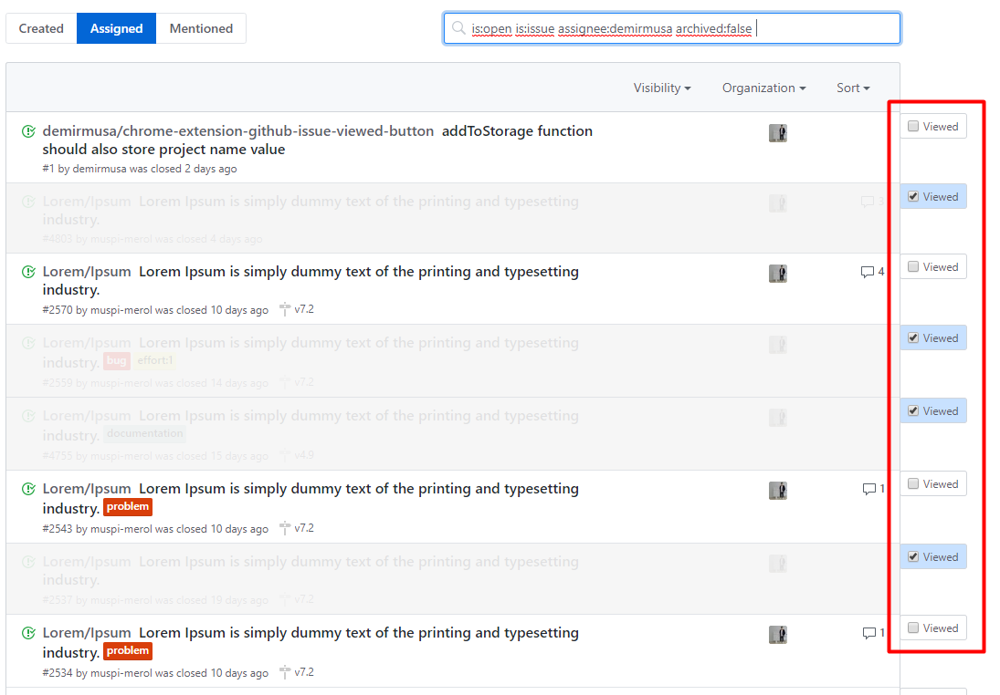
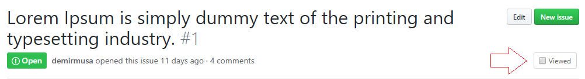
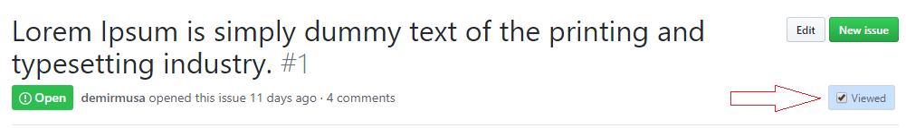

# Github Issue/PR Viewed Button
It adds viewed button to issue and pull request pages on github.  

[Download Chrome Extension](https://chrome.google.com/webstore/detail/github-issuepr-viewed-but/ccgbchelgeiehoombihniniaacfaccao)

To try it, 
* Download repository
* Chrome -> Extensions -> Load Unpackaged Extensions 
* Select src directory of repository
 
